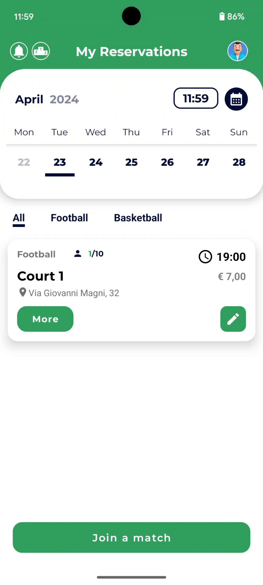
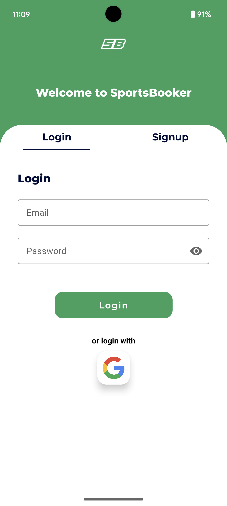
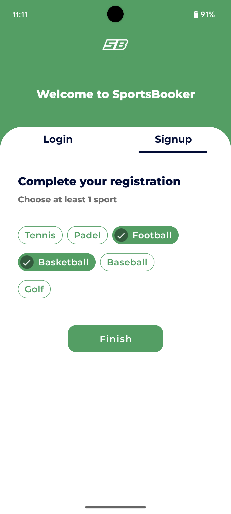
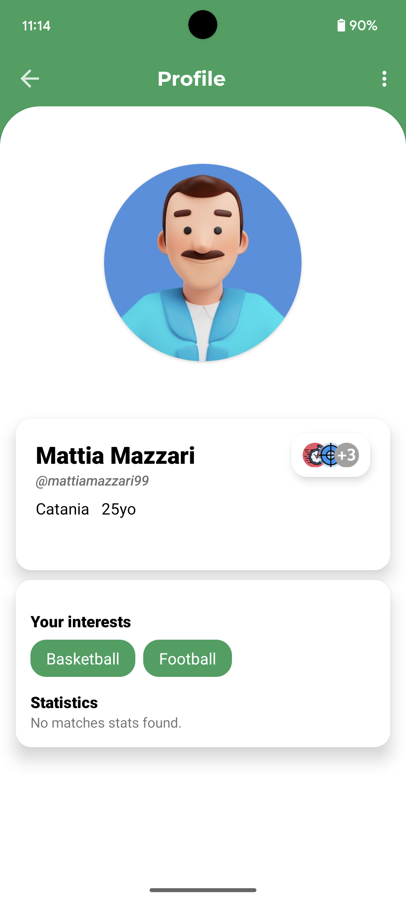
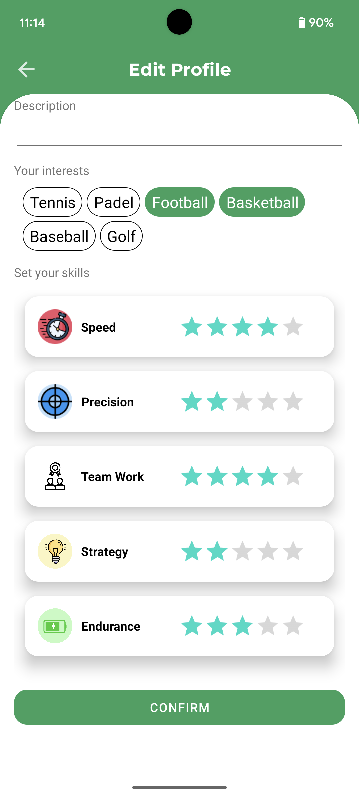
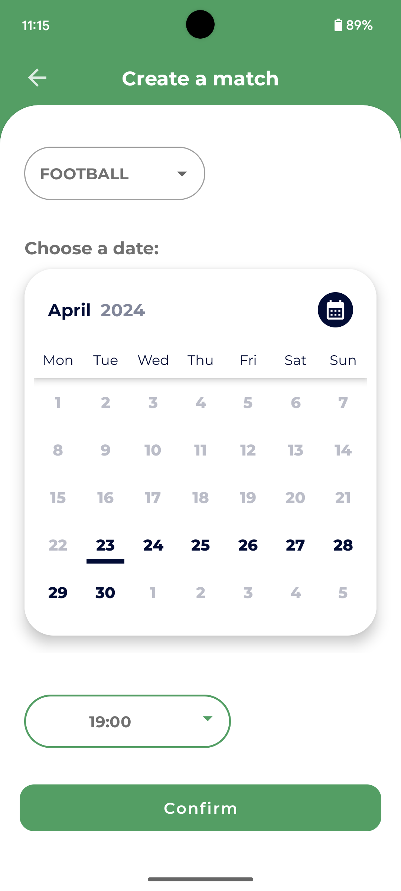
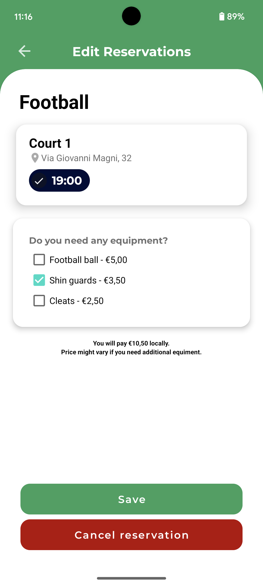
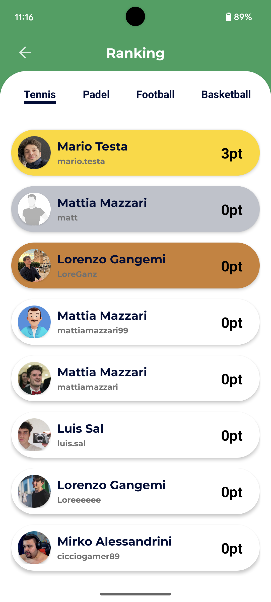

# SportsBooker: Book Your Game, Own Your Victory!

    

Android application to manage sports court reservations. We implemented several functionalities, users can:
- Manage their own profile, select the sports they are interested in, declare their skills and showcase their achievements   
- Browse existing reservations
- Check the availability of playing courts for specific dates and time slots
- Easily cancel or modify reservations they've created, offering flexibility in scheduling
- Rate and review courts or fields based on their quality and facilities, facilitating informed decision-making for other users.
- Engage in healthy competition by comparing performance with other players through a comprehensive scoring dashboard.

# Screenshots

    
    
    
    
    
    
    
    

  

